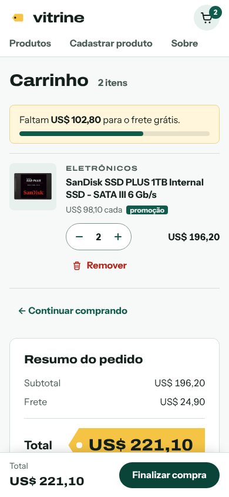
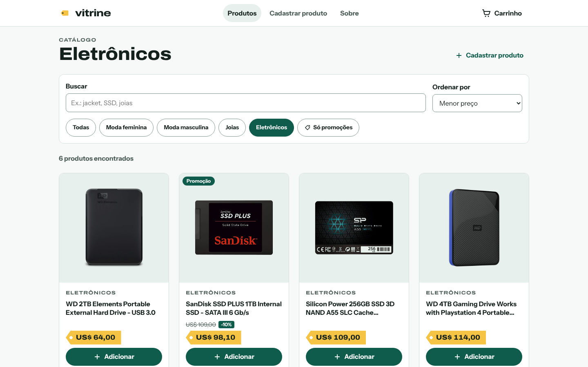

# Vitrine · loja em Angular

Loja virtual de demonstração feita em **Angular 20**: catálogo com busca e filtros na URL, carrinho com **signals** salvo no navegador e checkout simulado com **formulário reativo**.


- **Código:** [github.com/beatrizcampos-dev/loja-angular](https://github.com/beatrizcampos-dev/loja-angular)
- **Autora:** Beatriz Campos Alves

> Nenhuma compra é real: não existe cobrança, entrega nem envio de e-mail.

---

## O problema

Uma loja virtual parece simples até a primeira coisa dar errado: a API cai e a tela fica vazia sem explicação, o carrinho some ao recarregar a página, o formulário aceita CEP pela metade, o celular não consegue tocar no botão. Este projeto é a minha resposta a esses casos, usando só o que o próprio Angular oferece.
<!-- TODO(Beatriz): revisar este parágrafo com as suas palavras. -->

## Funcionalidades

- **Catálogo** com busca (sem diferenciar acentos), filtro por categoria, "só promoções" e ordenação por preço ou nome. Os filtros ficam na URL: o link pode ser compartilhado e o botão Voltar funciona.
- **Estados de tela de verdade:** esqueleto enquanto carrega, aviso quando a API cai e a loja usa a cópia local, erro com "Tentar de novo", estado vazio com ação.
- **Detalhe do produto** com galeria (zoom ao clicar), preço com desconto, seletor de quantidade e aviso (toast) ao adicionar.
- **Carrinho** com quantidade, remover, subtotal, frete simulado (grátis a partir de US$ 299) e barra de progresso até o frete grátis. Continua salvo depois de fechar o navegador e, ao ser aberto, atualiza preço e estoque com o catálogo atual.
- **Checkout simulado** com validação (e-mail, CEP com máscara 00000-000, endereço), foco no primeiro campo com erro e tela de pedido confirmado.
- **Cadastro de produto** com formulário reativo e prévia do card enquanto a pessoa digita.
- **Página 404**, título da aba por página e rotas carregadas sob demanda.

| Celular (390 px) | Computador (1440 px) |
|---|---|
|  |  |

Mais telas, antes e depois, em [`docs/screens/`](docs/screens/).

## De onde veio: começou como TP1 no IFSP

Começou como trabalho prático (TP1) da disciplina de Técnicas de Programação 1 no IFSP. Depois evoluí o projeto para parecer um produto real, mantendo o histórico de commits das aulas.
<!-- TODO(Beatriz): confirmar o nome da disciplina e o câmpus. O código do TP diz "Técnicas de Programação 1"; o briefing falava em "disciplina de Web". -->

| No TP1 | Agora |
|---|---|
| Se a API caía, aparecia "Nenhum produto em promoção encontrado" | Cópia local do catálogo + aviso + "Tentar de novo" |
| Página de cadastro em branco (erro no template) | Formulário reativo validado, com prévia do card |
| Botões "Adicionar" e "Detalhes" abriam `alert()` | Carrinho com signals, persistido no `localStorage` |
| Estoque e promoção sorteados com `Math.random()` a cada reload | Regra fixa por id, previsível e testada |
| Desconto arredondado para reais inteiros | Arredondado para centavos, mesma conta no pipe e no carrinho |
| Preço no detalhe aparecia como "synbol109.95" | US$ 109,95: formato brasileiro (`LOCALE_ID` pt-BR) e a moeda que a API usa |
| `any` no service, URL da API fixa no código | Tipos da API + `environment` |
| Pastas `produto/` e `produtos/`, componente `qunatidade-controle` | Uma pasta por funcionalidade, nomes corrigidos |
| Rota inexistente voltava para a home | Página 404 |
| Todas as páginas no bundle inicial | `loadComponent` em todas as rotas |
| 15 testes, 9 falhando | 122 testes de unidade e 8 de ponta a ponta passando |
| Logo institucional e imagens de medicamentos na pasta pública | Identidade visual própria e só imagens do catálogo |

## Decisões de design

- **Identidade:** a loja se chama Vitrine. A foto de cada produto fica sobre um fundo "de vidro" verde-claro e o preço aparece numa **etiqueta amarela**, com ponta e furo, como as de papel penduradas nas lojas. É o único elemento chamativo; o resto da interface é discreto.
<!-- TODO(Beatriz): confirmar se quer manter o nome "Vitrine". -->
- **Cores:** verde-escuro `#0f5c4d` (ações), amarelo `#f6c445` (etiquetas), tinta `#14201c` (texto). O verde é uma homenagem ao verde do TP original, mais escuro para passar no contraste AA.
- **Tipografia:** Archivo expandida nos títulos (lembra letreiro de loja) e Instrument Sans no texto.
- **Tokens em `:root`:** cores, espaços de 8/16/24/40/64 px, raio e sombra. Os componentes só usam as variáveis (`src/styles.css`).
- **Mobile primeiro:** grade de 2 colunas no celular, barra fixa com total e "Finalizar compra" no carrinho, alvos de toque de pelo menos 44 px.
- **Acessibilidade:** link "Pular para o conteúdo", foco visível, rótulos em todos os campos, erros ligados ao campo (`aria-describedby`), avisos em `aria-live`, `lang="en"` nos textos que a API manda em inglês.

## Tecnologias

- Angular 20 (componentes standalone, signals, `@if`/`@for`, `input()`/`output()`/`model()`)
- TypeScript, RxJS
- Angular Router (lazy loading, guard funcional, `TitleStrategy`, `withComponentInputBinding`)
- Reactive Forms, HttpClient, `NgOptimizedImage`
- Jasmine + Karma (com `HttpTestingController`)
- Playwright + axe-core (testes de ponta a ponta e de acessibilidade)
- CSS puro com variáveis (sem biblioteca de UI)
- Dados: [Fake Store API](https://fakestoreapi.com)

As decisões técnicas estão explicadas em linguagem simples no [ESTUDO.md](ESTUDO.md).

## Como rodar

Pré-requisito: Node.js 20.19+, 22.12+ ou 24+ (as versões que o Angular 20 aceita).

```bash
npm install
npm start            # abre em http://localhost:4200
npm test             # testes de unidade com o navegador aberto
npm run test:ci      # testes de unidade sem janela (terminal/CI)
npm run e2e          # testes de ponta a ponta (sobe o npm start sozinho)
npm run build        # build de produção em dist/
```

Na primeira vez que rodar `npm run e2e`, instale o navegador do Playwright: `npx playwright install chromium`.

## Como verificar

Tudo o que este README afirma sobre qualidade dá para conferir rodando dois comandos:

- `npm run test:ci`: 122 testes de unidade (Jasmine + Karma), incluindo o `CarrinhoService`, os pipes, os filtros e o `ProdutoService` com `HttpTestingController`.
- `npm run e2e`: 8 testes de ponta a ponta com Playwright, em 1440 px e 390 px. Eles fazem o fluxo completo (listar → filtrar → detalhe → adicionar → carrinho → checkout → confirmação) e falham se aparecer erro no console. Também testam o cadastro, a página 404 e a loja com a API fora do ar. Em cada tela, o axe-core verifica as regras de acessibilidade WCAG 2.2 A/AA.

Nos testes de ponta a ponta a Fake Store API é simulada a partir de `src/assets/produtos.json`, então eles não dependem da internet nem da API estar no ar.

## O que pratiquei e próximos passos

Pratiquei:
- separar estado (signals) de eventos no tempo (RxJS) e saber explicar por quê;
- tratar erro de API de um jeito que a pessoa entenda o que aconteceu;
- formulários reativos com validação condicional, máscara e acessibilidade;
- testar service com `HttpTestingController` e componente com `TestBed`.
<!-- TODO(Beatriz): ajustar esta lista ao que você sente que aprendeu de verdade. -->

Próximos passos:
- deploy (GitHub Pages ou Vercel) e link no topo deste README;
- servir as fotos por uma CDN que redimensiona (loader do `NgOptimizedImage`) e hospedar as fontes junto com o app;
- sincronizar o carrinho entre abas abertas (evento `storage`);
- rodar `npm run test:ci` e `npm run e2e` no GitHub Actions a cada push;
- buscar o endereço pelo CEP (ViaCEP);
- experimentar o `httpResource` quando ele sair da fase experimental.

---

Produtos, textos e fotos do catálogo vêm da [Fake Store API](https://fakestoreapi.com), projeto open source de MohammadReza Keikavousi (código sob licença MIT). A cópia local em `src/assets/produtos.json` e as fotos em `public/images/produtos/` foram geradas a partir dos dados públicos da API. Nomes e descrições dos produtos estão em inglês, e os preços em dólar (US$), como a API envia.
