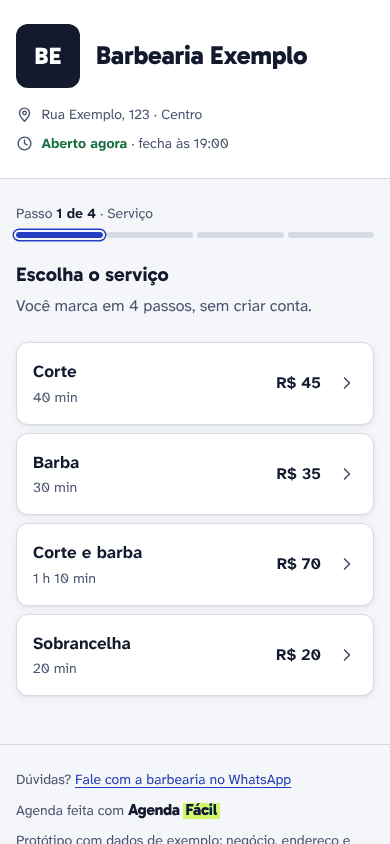

# Agenda Fácil

Agenda Fácil: case de UX + produto full stack, em construção. Agendamento online para pequenos negócios de serviço (salão, barbearia, estética, quadra): o cliente marca pelo celular, por um link, sem baixar app e sem criar conta.


- **Case de UX (Parte 1):** [design/README.md](design/README.md)
- **Protótipo navegável:** [design/prototipo/index.html](design/prototipo/index.html) (abre com dois cliques)
- **Figma:** TODO: link do Figma
- **Produto (Parte 2):** em breve
- **Deploy:** em breve
- **Código:** [github.com/beatrizcampos-dev/agenda-facil](https://github.com/beatrizcampos-dev/agenda-facil)
- **Autora:** Beatriz Campos Alves

---

## O problema

Em muito negócio pequeno, marcar horário é uma conversa de WhatsApp que vai e volta até combinar, e o combinado vai parar num caderno. Minha hipótese é que o dono perde tempo e cliente, e o cliente perde a paciência. Ainda não entrevistei ninguém: as hipóteses e o roteiro de entrevista estão em [design/pesquisa/](design/pesquisa/).
<!-- TODO(Beatriz): revisar este parágrafo com as suas palavras. -->

## Funcionalidades (protótipo)

- **Cliente:** escolhe serviço, profissional (ou "Sem preferência"), dia e horário em 3 ou 4 toques; informa só nome e WhatsApp; recebe um cartão do horário para salvar na agenda do celular; remarca ou cancela pelo link.
- **Dono:** cria a agenda em 3 passos com sugestões prontas, recebe o link e o QR code, e cuida do dia: confirmar, cancelar com "Desfazer", bloquear horário e adicionar quem ligou.
- **Estados de verdade:** dia lotado, erro em cada campo, horário reservado por outra pessoa no último segundo, dia sem agendamentos.



## Decisões de design

- **Sem conta para o cliente:** nome e WhatsApp bastam; o link do comprovante serve para remarcar ou cancelar.
- **Escolher já avança:** sem botão "Próximo"; um resumo com "Alterar" antes de confirmar.
- **Avisos pelo WhatsApp do próprio dono** (link `wa.me`), sem custo de API.
- **Identidade:** azul-caneta e verde marca-texto, Gabarito e Atkinson Hyperlegible, contraste AA calculado em cada par.

As 13 decisões, cada uma com o porquê, estão no [case](design/README.md#decisões-de-design).

## Tecnologias

Parte 1 (case e protótipo):
- HTML, CSS (variáveis, grid, `:has()`) e JavaScript sem framework
- Playwright (prints e testes dos fluxos) e axe-core (acessibilidade WCAG 2.2 A/AA)
- Mermaid (fluxos e mapa de telas)

Parte 2: em breve.

As decisões técnicas estão explicadas em linguagem simples no [ESTUDO.md](ESTUDO.md).

## Como rodar

O protótipo não precisa de instalação: abra `design/prototipo/index.html` no navegador.

Para refazer os prints e rodar as verificações (Node.js 20 ou mais novo):

```bash
cd design/ferramentas
npm install
npx playwright install chromium   # só na primeira vez
npm run verificar                 # fluxos do início ao fim, axe e alvos de toque
npm run telas                     # prints em design/telas e a capa em docs/
```

## O que aprendi / próximos passos

<!-- TODO(Beatriz): escrever o que aprendeu com as suas palavras. -->

Próximos passos:
- entrevistar 3 donos de negócio e 3 clientes (roteiro pronto);
- rodar o teste de usabilidade com 5 pessoas (5 tarefas prontas);
- Parte 2: construir o produto a partir dos [requisitos](design/requisitos.md).

---

Negócio, endereço, nomes, telefones e valores do protótipo são dados de exemplo. Fontes: Gabarito e Atkinson Hyperlegible Next e Mono (SIL Open Font License). Ícones no estilo Feather (MIT) e Lucide (ISC).
