# Agenda Fácil · case de UX

Agendamento online para pequenos negócios de serviço. O dono configura serviços e horários; o cliente marca pelo celular, por um link, sem baixar app e sem criar conta.

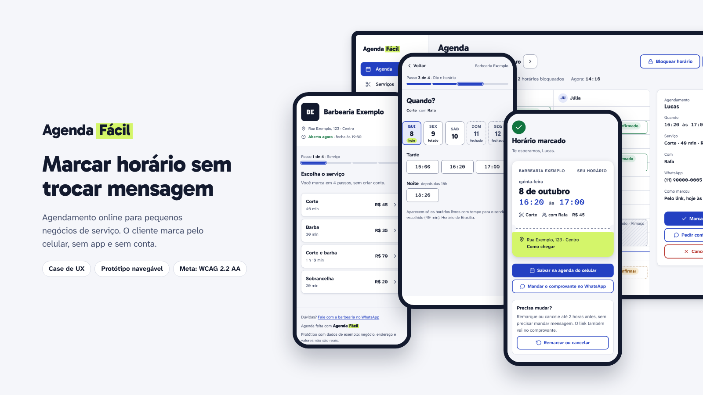

> **Rascunho para eu revisar.** Este texto está em primeira pessoa porque é o meu case, mas ainda não passou pela minha revisão final.
> TODO(Beatriz): ler em voz alta e reescrever com as minhas palavras tudo o que não soar como eu.

**Neste case, o que é fato e o que é hipótese:** ainda não entrevistei ninguém. Tudo o que digo sobre as pessoas é hipótese, e está marcado assim. O que tem fonte pública (o benchmark e um dado do Sebrae) tem link. Nada aqui é depoimento, número ou resultado inventado.

| Peça | Onde |
|---|---|
| Protótipo navegável (abre com dois cliques) | [`prototipo/index.html`](prototipo/index.html) |
| Arquivo no Figma (rascunho) | [Agenda Fácil · Case UX](https://www.figma.com/design/MpVoEKY4sBXdY5LbL2sO0d) · TODO(Beatriz): duplicar o arquivo para a conta Figma dela |
| Telas exportadas | [`telas/`](telas/) |
| Pesquisa | [`pesquisa/`](pesquisa/) |
| Design system | [design-system.md](design-system.md) |

---

## Contexto

É um projeto pessoal de portfólio, em duas partes. Esta é a Parte 1: o case de UX, do problema ao protótipo. A Parte 2 vai ser o produto full stack, construído a partir dos [requisitos](requisitos.md) que saíram daqui.

Queria um projeto com dois lados que precisam funcionar juntos: quem oferece o serviço e quem marca. E queria treinar o que mais me cobram como dev júnior: pensar antes de codar.

TODO(Beatriz): contar com as suas palavras por que escolheu esse problema. Se o cliente do seu freela tiver um negócio de serviço e autorizar, ele pode ser o caso real do projeto (sem citar o nome antes da autorização).

## Problema

Em muito negócio pequeno de serviço, marcar horário é uma conversa de WhatsApp: o cliente pergunta se tem horário, o dono responde quando pode, os dois vão e voltam até combinar, e alguém anota num caderno. Minha hipótese é que isso custa caro para os dois lados:

- **o dono** para o atendimento para responder mensagem, esquece de anotar e descobre a falta na hora;
- **o cliente** espera resposta, às vezes desiste, e esquece o horário que marcou.

Existe um dado público que ajuda a entender o tamanho do WhatsApp nesse mundo: segundo reportagem da Agência Sebrae sobre a 12ª edição da pesquisa Pulso dos Pequenos Negócios (2026), oito em cada dez donos de pequenos negócios apontam o WhatsApp como o principal canal de comunicação e de vendas ([Agência Sebrae](https://agenciasebrae.com.br/dados/whatsapp-se-consolida-nas-vendas-on-line-enquanto-facebook-e-lojas-proprias-perdem-folego/)). Esse dado não diz nada sobre agendamento em si; é por isso que as entrevistas são o próximo passo.

**A pergunta do projeto:** como o cliente pode marcar um horário sozinho, a qualquer hora, sem trocar mensagens, sem baixar app e sem criar conta, e como o dono pode ver e cuidar do dia sem passar o dia no celular?

## Público

Escrevi duas [proto-personas](pesquisa/proto-personas.md). São **hipóteses**, sem foto de propósito, para eu saber o que perguntar nas entrevistas:

- **Rosa, dona de um salão pequeno** (hipótese, validar em entrevista). Atende e administra ao mesmo tempo, recebe pedidos no WhatsApp pessoal e anota num caderno. Quer encher a agenda sem viver no celular.
- **Lucas, cliente** (hipótese, validar em entrevista). Marca pelo celular, muitas vezes à noite. Quer ver os horários livres e marcar em poucos toques. Desistiria se tivesse que criar conta para cortar o cabelo.

Também desconfio que **quadra esportiva** funciona diferente (aluguel por hora, mensalistas, grupo). Por isso o passo "profissional" do fluxo pode virar "quadra".

## Pesquisa

| | Status | Onde |
|---|---|---|
| Proto-personas | Hipótese | [proto-personas.md](pesquisa/proto-personas.md) |
| 9 hipóteses, com o que muda se forem falsas | Não validadas | [hipoteses.md](pesquisa/hipoteses.md) |
| Roteiro de entrevista (10 perguntas para donos, 10 para clientes) | Pronto, não aplicado | [roteiro-entrevista.md](pesquisa/roteiro-entrevista.md) |
| Planilha de síntese | Vazia, esperando as entrevistas | [sintese.csv](pesquisa/sintese.csv) |
| Benchmark de 4 apps | Fontes públicas, verificação parcial | [benchmark.md](pesquisa/benchmark.md) |

TODO(Beatriz): entrevistar 3 donos de negócio e 3 clientes.

No roteiro, as perguntas são sobre **o que a pessoa fez da última vez**, não sobre o que ela faria ("você usaria um app que...?"), porque quase todo mundo responde sim por educação.

### Benchmark

Olhei Trinks, Booksy, AppBarber e Playtomic usando só informação pública (central de ajuda, página de preços, loja de apps, Reclame Aqui), com a fonte em cada linha. Uma ressalva honesta: no ambiente em que montei este rascunho, as páginas não abriam direto, então conferi cada afirmação no trecho que a busca devolvia. Os trechos estão no [apêndice de evidências](pesquisa/benchmark-evidencias.md).
TODO(Beatriz): abrir cada link do benchmark e confirmar antes de publicar.

O que mais pesou nas minhas decisões (é interpretação minha, os fatos com fonte estão no benchmark):

- Nos quatro, a documentação descreve um cadastro do cliente no caminho do agendamento. No Booksy e na Playtomic, com verificação por código no celular ou link no e-mail. Só no Booksy não ficou claro se dá para marcar pelo link sem conta.
- Mudar um horário raramente é simples: no Booksy, remarcar cancela o original; na Playtomic, trocar data ou horário exige falar com o clube; no AppBarber, cancelar é pelo app ou com a barbearia. A Trinks tem "Quero reagendar", mas dentro do app dela.
- Trinks e Booksy ensinam o dono a colocar o link de agendamento na mensagem automática do WhatsApp Business: o WhatsApp é a porta de entrada.
- Na Trinks, a confirmação por WhatsApp sai do número e com a marca da plataforma, não do salão.

## Jornada atual

Montei a [jornada de hoje](pesquisa/jornada-atual.md) como hipótese: pedir horário, esperar resposta, combinar, anotar, lembrar, desmarcar. Cada etapa tem uma dor provável e uma oportunidade.

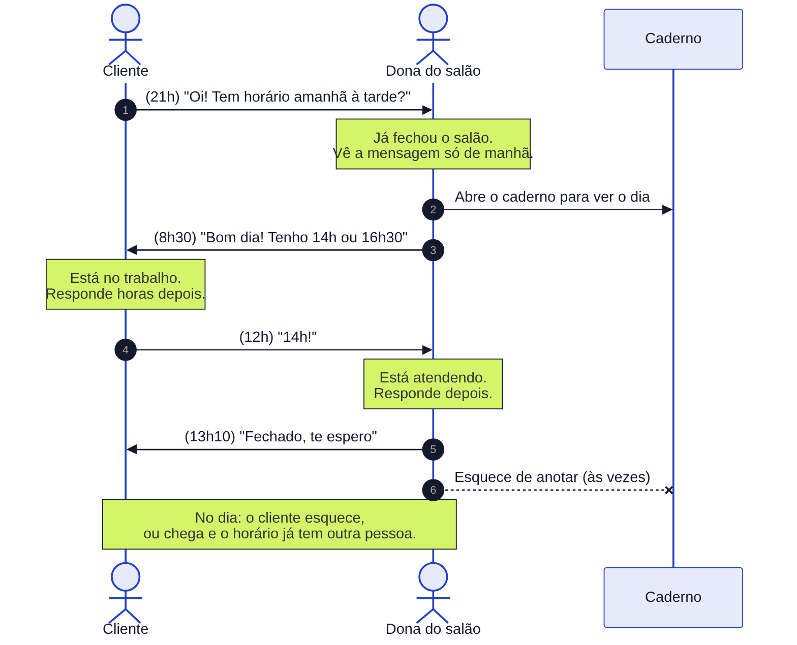

## Oportunidades

Da jornada e do benchmark saíram as oportunidades que viraram o produto:

| Dor (hipótese) | Oportunidade |
|---|---|
| O cliente precisa perguntar o que está livre | Mostrar só os horários livres, a qualquer hora |
| O dono para o atendimento para responder | O cliente marca sozinho; o dono vê o resultado na agenda |
| Ida e volta até combinar | Escolher e reservar em 3 ou 4 toques |
| Esquecer de anotar, marcar duas pessoas no mesmo horário | A marcação já entra na agenda; o sistema não deixa dois no mesmo horário |
| Faltas sem aviso | Comprovante para salvar na agenda do celular; pedir confirmação pelo WhatsApp |
| Desmarcar dá trabalho | Link "Meu horário" para remarcar ou cancelar, e o horário volta a ficar livre |

Os requisitos estão priorizados com MoSCoW em [requisitos.md](requisitos.md) e são o backlog da Parte 2.

## Fluxos

Três fluxos cobrem o MVP. Os diagramas em Mermaid estão em [fluxos.md](fluxos.md) e o mapa de telas em [arquitetura-informacao.md](arquitetura-informacao.md).

| Cliente agenda | Dono configura | Dono gerencia o dia |
|---|---|---|
| 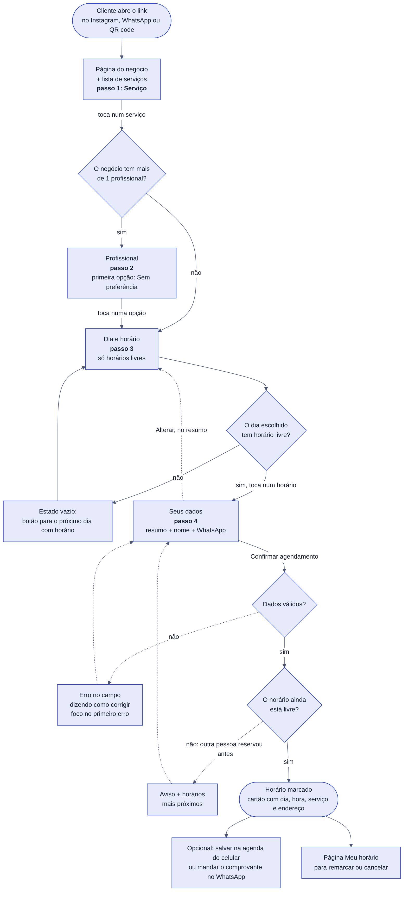 | 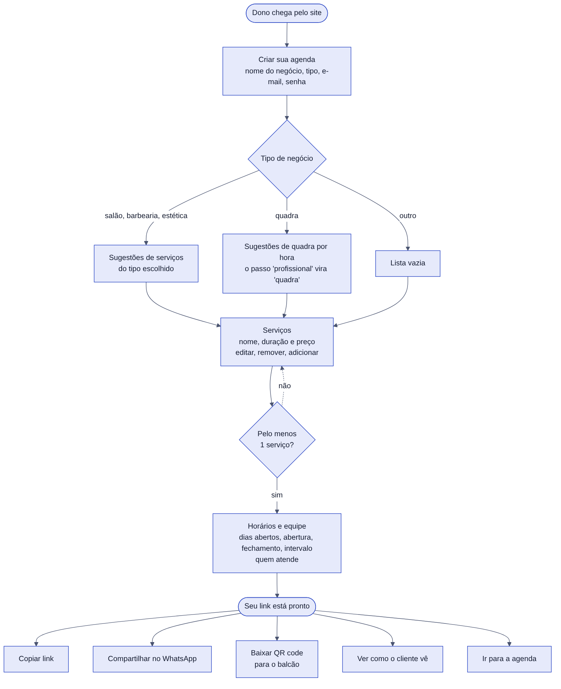 | 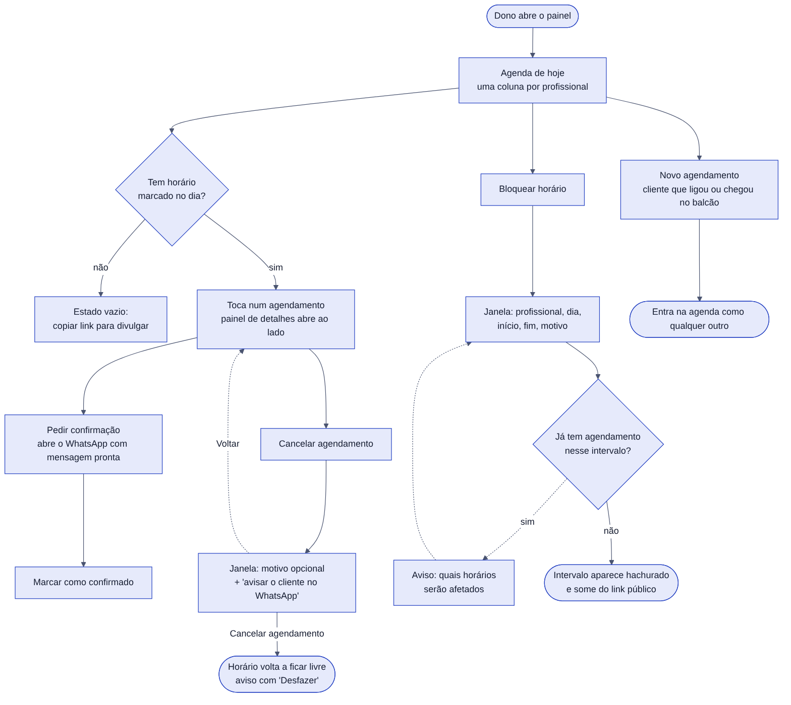 |

## Wireframes

Comecei com [wireframes em baixa fidelidade](wireframes/index.html): 7 telas do cliente e 2 do painel. Depois avaliei os meus próprios wireframes com as 10 heurísticas de Nielsen, mais celular, fricção e acessibilidade básica. Achei 12 problemas. Os mais graves:

- horário ocupado diferente do livre só pela cor, e dia escolhido antes de saber se tinha vaga;
- erro genérico no topo do formulário e rótulo que sumia ao digitar;
- cancelar no painel com um ícone de lixeira, sem confirmação e sem desfazer;
- 11 toques e 4 campos para marcar um corte.

A [avaliação completa](avaliacao-heuristica.md) tem cada achado com o antes e o depois. Pela minha nota (que é opinião, não medida), a média foi de 2,2 para 4,0 de 5.

| Antes (v1) | Depois (v2) |
|---|---|
| 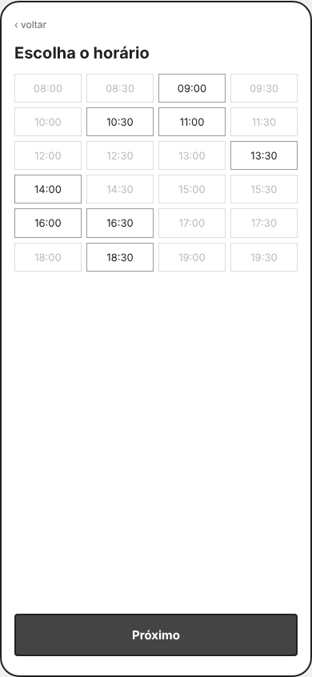 | 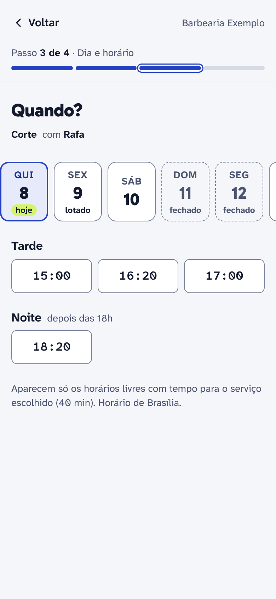 |
| 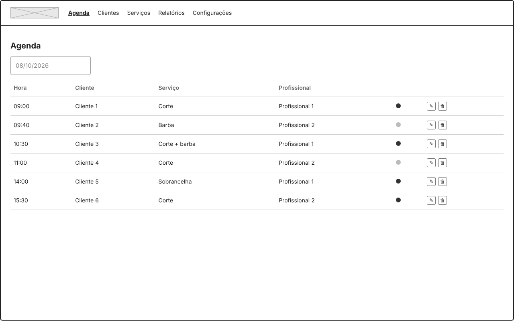 | 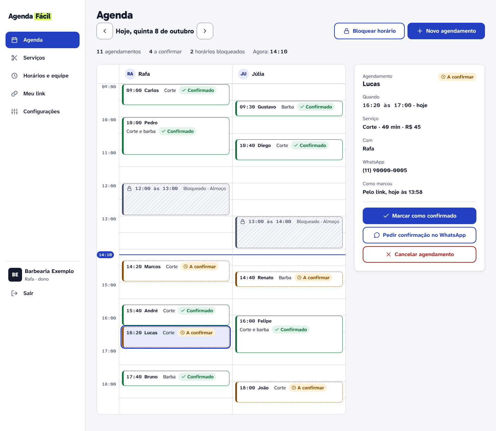 |

## Protótipo

Construí o protótipo em **HTML e CSS estáticos**, com um pouco de JavaScript, em [`prototipo/`](prototipo/). Abre com dois cliques, sem internet e sem instalar nada. Negócio, nomes, telefones e valores são dados de exemplo.

**Cliente, no celular:** serviço → profissional → dia e horário → seus dados → horário marcado → meu horário.

| Serviço | Profissional | Dia e horário | Seus dados | Horário marcado |
|---|---|---|---|---|
| 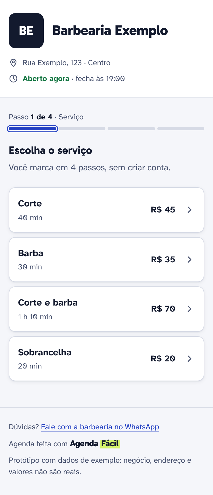 | 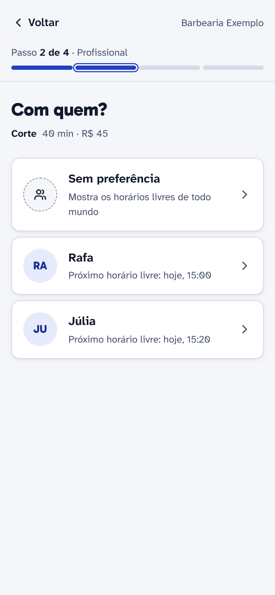 |  | 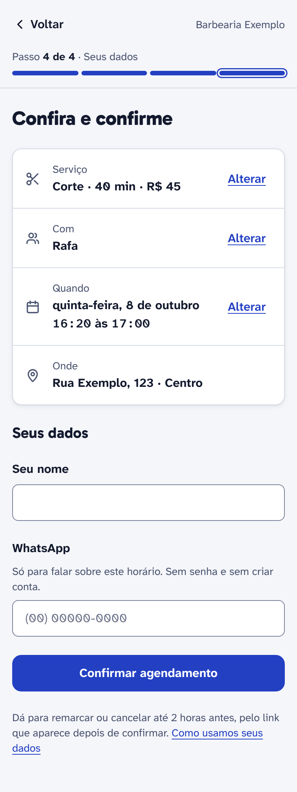 | 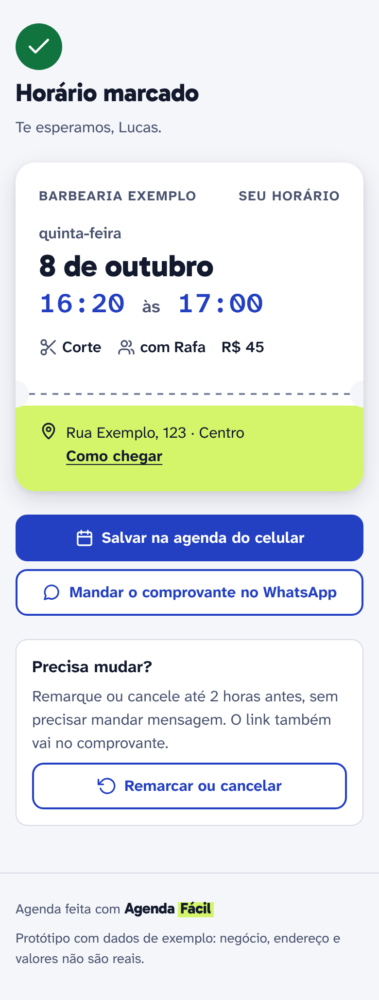 |

**Dono, no computador:** criar a agenda em 3 passos, receber o link e cuidar do dia.

| Cadastro | Serviços | Link pronto |
|---|---|---|
| 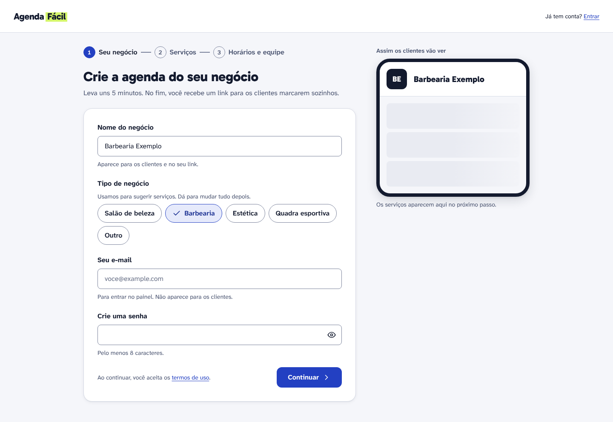 | 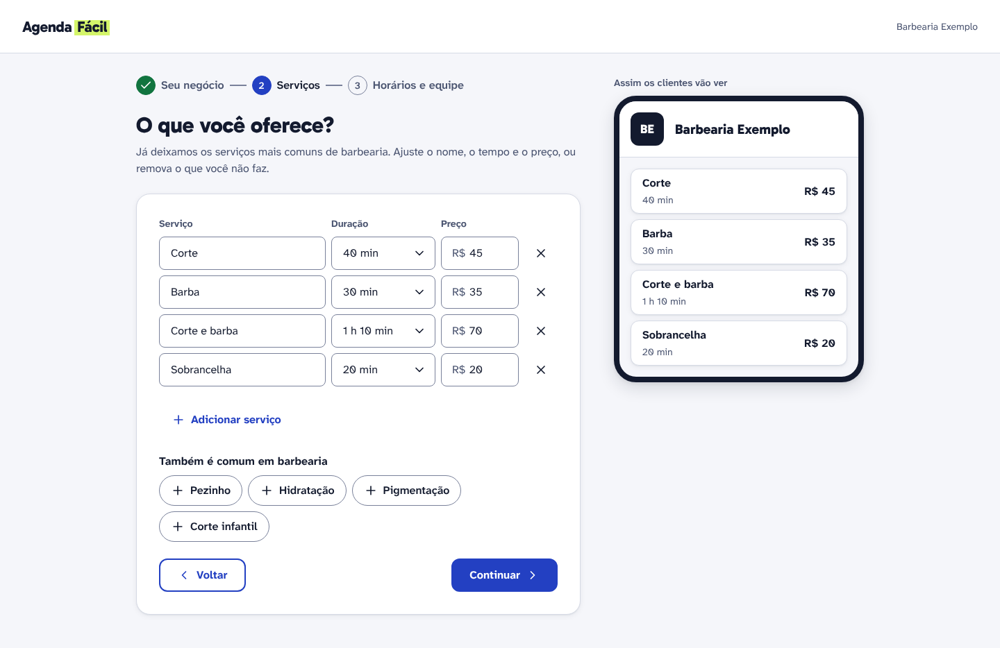 | 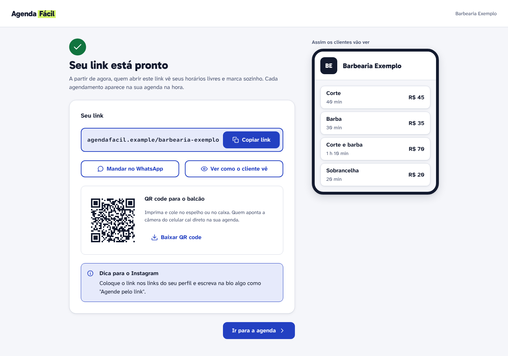 |

| Agenda do dia | Bloquear horário (com conflito) | Agenda no celular |
|---|---|---|
|  | 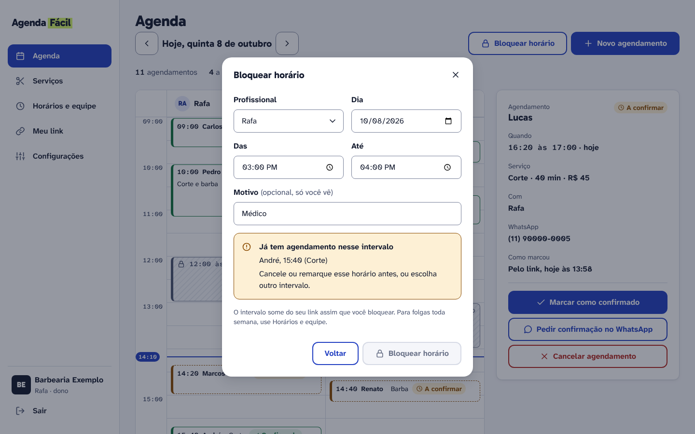 | 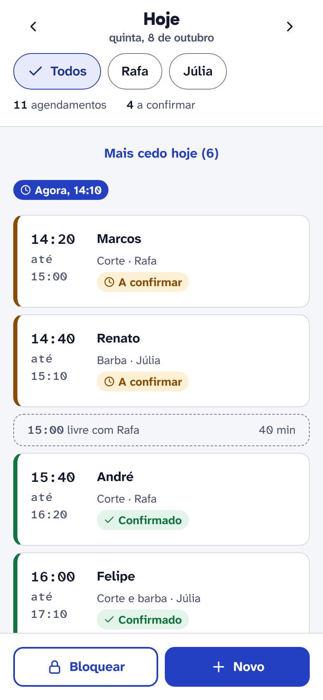 |

Estados que também desenhei: dia lotado, erro nos campos, horário reservado por outra pessoa no último segundo, cancelamento com "Desfazer", dia sem agendamentos. Todos estão em [`telas/`](telas/) e listados no [índice do protótipo](prototipo/index.html).

**Como verifiquei:** um script ([`ferramentas/verificar.mjs`](ferramentas/verificar.mjs)) percorre os fluxos do cliente e do dono do início ao fim, roda o axe-core (WCAG 2.2 A e AA) nas 24 telas e estados e mede os alvos de toque. Hoje passa sem nenhum problema. Ele achou um bug real: ao tocar em "Confirmar agendamento", a mensagem de erro do campo aparecia, empurrava o botão para baixo e o toque se perdia. Corrigi e deixei um teste para o bug não voltar.

### Figma

Arquivo: [Agenda Fácil · Case UX](https://www.figma.com/design/MpVoEKY4sBXdY5LbL2sO0d) (rascunho).
TODO(Beatriz): duplicar o arquivo para a conta Figma dela e trocar este link pelo da cópia.

O que já está lá, na página "Wireframes · UI":

- **Variáveis** com os mesmos nomes do CSS: cores (`caneta`, `marca-texto`, `erro`…), espaços (de 4 a 48, mais o alvo mínimo de 44) e raios. Cada variável mostra o nome no código (`var(--caneta)`), então design e código falam a mesma língua.
- **Estilos** de texto (Gabarito e Atkinson Hyperlegible) e de sombra.
- **Componentes com variantes e propriedades:** botão, campo, horário, chip de serviço, selo de status, toast, opção de profissional, dia, indicador de passos, topo, resumo, estado vazio, aviso, cartão do horário, bloco da agenda, menu e item do dia no celular. Os estados ficam nas variantes.
- **14 telas de alta fidelidade** feitas com esses componentes: 7 do cliente (celular) e 7 do painel (computador e a agenda no celular).

O plano gratuito do Figma aceita 3 páginas por arquivo, então juntei as cinco partes em três páginas: "Pesquisa · Fluxos", "Wireframes · UI" e "Protótipo".
TODO(Beatriz): completar no Figma a página "Pesquisa · Fluxos" (pode colar os diagramas de [fluxos.md](fluxos.md)) e a página "Protótipo" (ligar as telas do cliente com interações de clique), e passar os [wireframes v1](wireframes/index.html) para lá. Até lá, a pesquisa e os fluxos estão neste repositório e o protótipo navegável é o HTML.

As imagens em [`telas/`](telas/) são prints do protótipo HTML, que tem o mesmo design das telas do Figma.

## Decisões de design

**1. O cliente não cria conta: nome e WhatsApp bastam.**
Os quatro apps do benchmark descrevem algum cadastro do cliente para marcar, e minha hipótese H5 é que isso faz o cliente desistir. O risco é o dono não confiar num agendamento tão simples (H6). Para isso, o dono pode pedir a confirmação pelo WhatsApp com um toque, e deixei "aprovar cada pedido" como opção futura (Could).

**2. Escolher já avança.**
Tocar num serviço, num profissional ou num horário leva direto ao passo seguinte, sem botão "Próximo". São 3 ou 4 toques e 2 campos, contra 11 toques e 4 campos na v1. O risco é um toque sem querer; a defesa é o resumo com "Alterar" em cada item antes de confirmar, e "Alterar" volta para o resumo sem perder o resto.

**3. "Sem preferência" vem primeiro, e o passo some quando há uma pessoa só.**
Suspeito que escolher o profissional importa para parte dos clientes, mas não para todos (H8). Quem liga escolhe; quem não liga toca na primeira opção. Cada profissional mostra o próximo horário livre, para a pessoa decidir sem abrir um por um.

**4. Dia e horário na mesma tela, e só horários livres.**
Na v1, o cliente escolhia o dia sem saber se tinha vaga. Agora a faixa de dias diz "lotado" ou "fechado", o primeiro dia com vaga já vem escolhido e um dia lotado oferece o próximo dia com horário. Horário ocupado nem aparece.

**5. Dois clientes nunca ficam com o mesmo horário.**
Se outra pessoa confirmar um segundo antes, o cliente vê o aviso, os dados que digitou continuam ali e aparecem os horários mais próximos. Na Parte 2, essa regra vai ficar no banco de dados, não só na tela.

**6. A confirmação é um cartão de horário.**
É a única peça visualmente ousada do produto: lembra o cartãozinho de papel com o "próximo horário" que salão entrega no balcão, com picote e canhoto em marca-texto. Junto vêm "Salvar na agenda do celular" (um arquivo .ics) e "Mandar o comprovante no WhatsApp".

**7. Remarcar e cancelar pelo link, com a regra à vista.**
No benchmark, remarcar costuma exigir cancelar e marcar de novo, falar com o estabelecimento ou abrir o app da plataforma. Aqui, a página "Meu horário" (o link do comprovante) tem "Remarcar" e "Cancelar agendamento", e a regra do negócio ("até 2 horas antes") aparece antes, não depois.

**8. Os avisos saem do WhatsApp do próprio dono.**
"Pedir confirmação" e "Avisar o cliente" abrem o WhatsApp do dono com a mensagem pronta (link `wa.me`). Não custa nada, não depende da API paga do WhatsApp e a mensagem chega com o nome do negócio, não da plataforma. Lembrete automático ficou como Could, depois de avaliar o custo.

**9. Painel pensado para o computador, com a agenda do dia também no celular.**
O pedido era um painel para computador, mas minha hipótese H7 é que o dono cuida do dia pelo celular. Desenhei as duas versões da agenda do dia. Se a entrevista confirmar H7, a do celular sobe para Must.

**10. A agenda do dono parece um caderno organizado.**
Uma coluna por profissional, com uma linha a cada 30 minutos, como a pauta do caderno que ela substitui. Status sempre com ícone e texto ("Confirmado", "A confirmar"), e a borda muda de contínua para tracejada, para não depender da cor. Horário bloqueado é hachurado e escrito.

**11. Criar a agenda leva 3 passos, já preenchidos.**
A v1 era uma tela com 31 campos vazios. Agora o tipo de negócio sugere os serviços, o horário vem com um padrão comum e uma prévia mostra o que o cliente vai ver. O dono só ajusta.

**12. Identidade própria, pensada para ser lida por qualquer pessoa.**
Azul-caneta para ações, verde marca-texto como destaque raro, Gabarito nos títulos e Atkinson Hyperlegible no texto (uma fonte criada pelo Braille Institute para baixa visão). Todo par de cores foi calculado e passa no AA. Detalhes em [design-system.md](design-system.md) e [acessibilidade.md](acessibilidade.md).

**13. Protótipo em HTML, não só em Figma.**
Posso testar no celular de verdade da pessoa, verificar acessibilidade com ferramenta e reaproveitar tokens e componentes na Parte 2. O arquivo do Figma serve para mostrar e para colaborar.

## Testes de usabilidade

Escrevi um [roteiro com 5 tarefas](testes-usabilidade.md), cada uma com critérios de sucesso (sem ajuda, tempo máximo, toques fora do caminho):

1. marcar um horário com a Rafa hoje à tarde;
2. trocar o serviço antes de confirmar;
3. cancelar o horário marcado;
4. pedir a confirmação de um cliente e cancelar outro (dono);
5. bloquear um horário por causa de um compromisso (dono).

**Resultados:** TODO(Beatriz): rodar o teste com 5 pessoas e preencher. Ainda não há resultado nenhum.

## Próximos passos

- TODO(Beatriz): entrevistar 3 donos e 3 clientes, preencher a planilha de síntese e atualizar as hipóteses.
- TODO(Beatriz): rodar o teste de usabilidade com 5 pessoas.
- TODO(Beatriz): duplicar o arquivo do Figma para a conta dela e completar as páginas "Pesquisa · Fluxos" e "Protótipo".
- Revisar personas, requisitos e telas com o que as entrevistas e o teste mostrarem.
- Resolver os achados abertos da avaliação (botão de confirmar abaixo da dobra, estado sem internet).
- Parte 2: construir o produto com os [requisitos](requisitos.md) Must primeiro.

## O que aprendi

TODO(Beatriz): escrever com as suas palavras. Sugestões do que pode entrar:
- separar hipótese de fato muda o jeito de escrever um case;
- avaliar o próprio wireframe com uma lista pega coisas óbvias que eu não via;
- um script de verificação acha bug de verdade, não só regra quebrada.

---

**Texto curto para o card do portfólio (rascunho):**

> **Agenda Fácil · case de UX.** Agendamento online para pequenos negócios de serviço: o cliente marca pelo celular em 3 ou 4 toques, sem baixar app nem criar conta, e o dono cuida do dia num painel. Pesquisa planejada (hipóteses marcadas como hipóteses), benchmark com fontes, fluxos, wireframes avaliados com as heurísticas de Nielsen e protótipo navegável com acessibilidade AA verificada.
