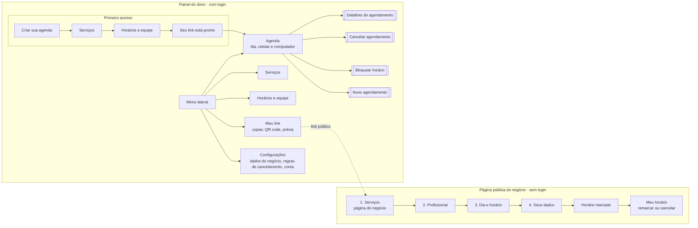

# Arquitetura de informação

O Agenda Fácil tem duas "casas" que não se misturam:

- **Página pública do negócio** (o link): para o cliente final. Sem login, sem menu, só o caminho do agendamento. Celular primeiro.
- **Painel do dono**: para quem cuida da agenda. Com login e menu lateral. Pensado primeiro para computador, com a "Agenda do dia" também no celular (hipótese H7 em [hipoteses.md](pesquisa/hipoteses.md)).

## Mapa de telas

Retângulo de borda dupla é janela (diálogo) ou painel lateral dentro da Agenda, não uma página nova.

## O que cada tela mostra

| Tela | Para quem | Pergunta que a tela responde | Conteúdo principal | Ação principal | Estados |
|---|---|---|---|---|---|
| Serviços (página do negócio) | Cliente | "Esse lugar faz o que eu quero? Quanto custa?" | Nome, endereço e contato do negócio; serviços com duração e preço | Tocar num serviço | carregando, negócio sem serviços, link inválido |
| Profissional | Cliente | "Com quem?" | "Sem preferência" primeiro; depois cada profissional com o próximo horário livre | Tocar numa opção | só aparece se houver mais de 1 profissional |
| Dia e horário | Cliente | "Quando?" | Faixa de dias; horários livres em manhã, tarde e noite | Tocar num horário | dia fechado, dia sem horário (estado vazio), carregando |
| Seus dados | Cliente | "Está tudo certo? Quem é você?" | Resumo com "Alterar"; nome; WhatsApp | Confirmar agendamento | erro de campo, enviando, horário acabou de ser ocupado |
| Horário marcado | Cliente | "Deu certo? E agora?" | Cartão do horário; endereço; como remarcar ou cancelar | Salvar na agenda do celular | — |
| Meu horário | Cliente | "Preciso mudar, como faço?" | Cartão do horário; regra de cancelamento do negócio | Remarcar / Cancelar | fora do prazo de cancelamento, já cancelado |
| Criar sua agenda | Dono | "Começo por onde?" | Nome do negócio, tipo, e-mail, senha | Continuar | erro de campo, e-mail já cadastrado |
| Serviços (painel) | Dono | "O que eu ofereço?" | Lista editável com duração e preço, já sugerida pelo tipo de negócio | Continuar / Salvar | lista vazia |
| Horários e equipe | Dono | "Quando eu atendo e quem atende?" | Dias da semana, abertura, fechamento, intervalo; profissionais | Continuar / Salvar | erro: fechamento antes da abertura |
| Seu link está pronto / Meu link | Dono | "Como eu divulgo?" | Link, copiar, WhatsApp, QR code, prévia | Copiar link | link copiado (aviso) |
| Agenda do dia | Dono | "Como vai ser o meu dia?" | Grade do dia por profissional; resumo do dia; detalhes ao lado | Abrir um agendamento | dia vazio, carregando, erro ao salvar |

## Rótulos e vocabulário

Escolhi palavras que o dono e o cliente já usam, e a mesma palavra do começo ao fim do fluxo:

| Uso | Não uso | Por quê |
|---|---|---|
| horário | slot, vaga, reserva | É como se fala em salão e barbearia. |
| agendamento | booking, evento | "Cancelar agendamento" diz exatamente o que acontece. |
| Sem preferência | Qualquer um, Indiferente | Soa educado e diz que o sistema escolhe pela pessoa. |
| Bloquear horário | Indisponibilidade, Pausa | Verbo de ação, igual ao que o dono faria no caderno ("risquei o horário"). |
| Profissional (renomeável para Quadra) | Recurso, Colaborador | Ver a variação de quadra nas [proto-personas](pesquisa/proto-personas.md). |
