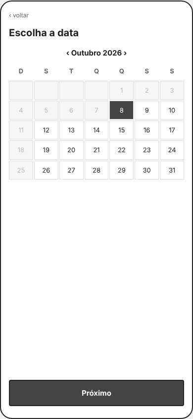
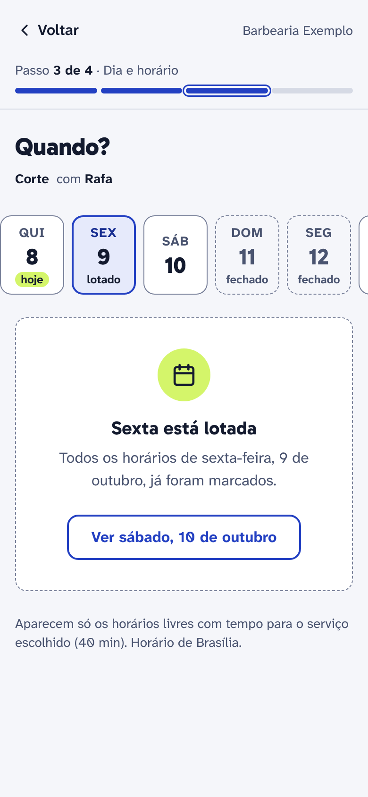
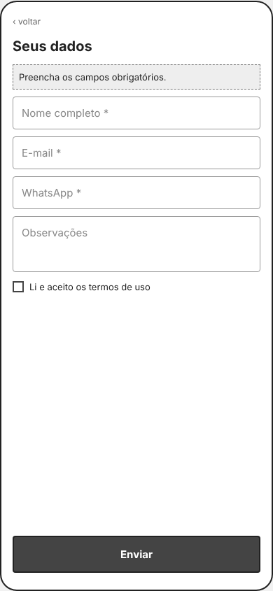
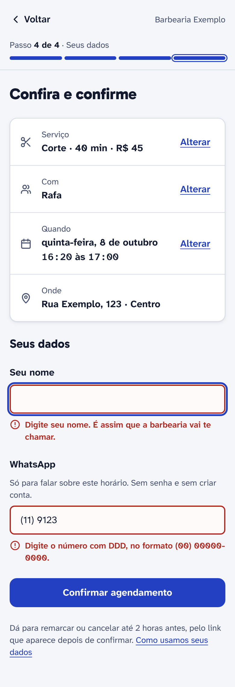
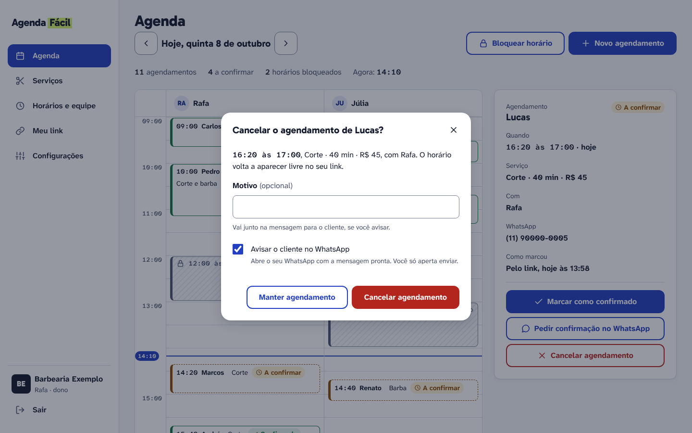
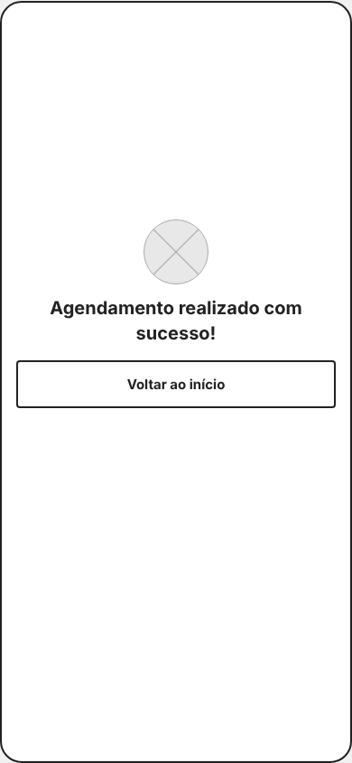
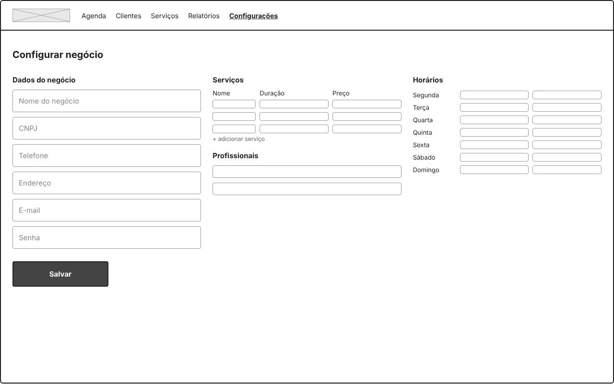
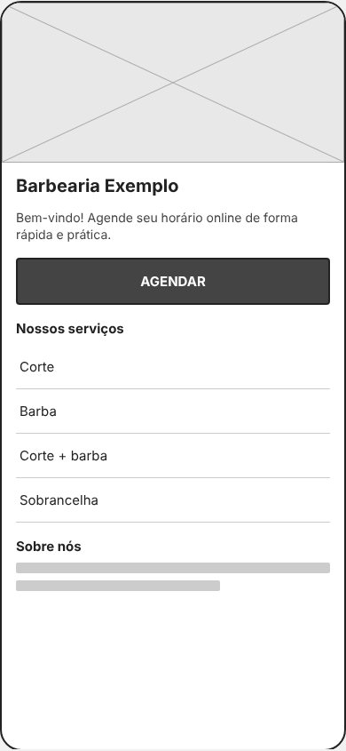
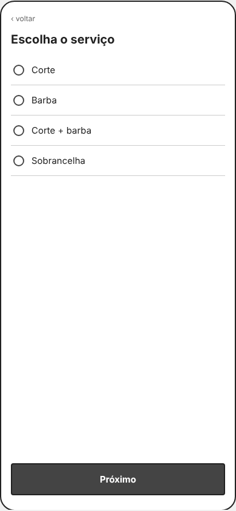

# Avaliação heurística: antes e depois

Esta avaliação olha os [wireframes v1](wireframes/index.html), uma primeira versão ingênua de propósito, com as 10 heurísticas de Nielsen, mais três olhares que importam muito aqui: usabilidade no celular, fricção no fluxo de agendamento e acessibilidade básica. Depois os problemas foram corrigidos no protótipo de alta fidelidade (v2), e a v2 foi avaliada de novo.

> **O que isto é e o que não é.** É uma avaliação feita com um assistente de IA (Claude Code), sem revisão de outra pessoa, olhando as telas com uma lista de critérios. Ajuda a pegar problemas óbvios antes de mostrar para alguém, mas **não substitui teste com usuário**: as notas são opinião de quem avaliou, não uma medida. E como a v1 já nasceu para ser avaliada, a diferença de nota mostra o que mudou, não um ganho medido. O ideal são 3 a 5 avaliadores.

<!-- TODO(Beatriz): refazer esta avaliação sozinha, sem ler as notas abaixo, e comparar. -->

<!-- TODO(Beatriz): pedir para 2 colegas avaliarem os wireframes v1 com esta mesma lista, sem ver as notas desta avaliação, e comparar. -->

**Escala da nota:** 5 excelente · 4 bom · 3 aceitável · 2 problemático · 1 crítico.
**Severidade dos achados:** S0 impede de concluir · S1 grave · S2 moderado · S3 cosmético.

---

## Resumo das notas

| # | Heurística | v1 | v2 | O que mudou |
|---|---|---|---|---|
| 1 | Visibilidade do status do sistema | 2 | 4 | Indicador "Passo 2 de 4", botão "Confirmando…", toasts, cartão do horário |
| 2 | Correspondência com o mundo real | 3 | 4 | Faixa de dias com "hoje", turnos, vocabulário de salão, horário de Brasília |
| 3 | Controle e liberdade | 2 | 4 | "Alterar" no resumo, remarcar ou cancelar pelo link, "Desfazer" no painel |
| 4 | Consistência e padrões | 3 | 4 | A mesma ação tem o mesmo nome do começo ao fim |
| 5 | Prevenção de erros | 1 | 4 | Só aparecem horários livres; cancelar pede confirmação; bloquear avisa conflito |
| 6 | Reconhecer em vez de lembrar | 2 | 5 | Resumo antes de confirmar; escolhas sempre visíveis no topo |
| 7 | Flexibilidade e eficiência | 2 | 4 | De 11 toques e 4 campos para 3 ou 4 toques e 2 campos |
| 8 | Estética e design minimalista | 3 | 4 | Sem texto de propaganda, sem CNPJ, sem menus fora do MVP |
| 9 | Reconhecer e recuperar de erros | 1 | 4 | Erro no campo dizendo como corrigir; horários próximos quando o escolhido acaba |
| 10 | Ajuda e documentação | 3 | 3 | Regras de cancelamento e dicas no lugar certo; ainda sem central de ajuda |
| | **Média** | **2,2** | **4,0** | |
| | **Pontuação (média ÷ 5 × 100)** | **44** | **80** | |

A pontuação é só para comparar a v1 com a v2 deste projeto. Não é um número para comparar com outros produtos.

---

## Achados da v1, do mais grave para o menos grave

### 1. Horário ocupado parece escolhível e o dia pode não ter horário nenhum · S1

- **Heurísticas:** 5 (prevenção de erros), acessibilidade.
- **Problema:** em W5, os horários ocupados aparecem em cinza-claro, misturados com os livres. A diferença é só a cor. Em W4, o cliente escolhe o dia antes de saber se ele tem horário livre.
- **Por que importa:** quem não enxerga bem a diferença de cinza toca num horário ocupado. E quem escolhe um dia lotado só descobre isso na tela seguinte, depois de mais um toque.
- **Antes:** calendário do mês (W4) → grade com 24 horários, a maioria em cinza (W5).
- **Depois:** um passo só, "Quando?". Uma faixa de dias diz "lotado" ou "fechado" com texto, e só aparecem os horários **livres** do dia escolhido, separados em manhã, tarde e noite. Dia lotado mostra um estado vazio com o botão "Ver sábado, 10 de outubro".

| Antes (W4 + W5) | Depois |
|---|---|
|   |   |

### 2. Erro genérico no topo e rótulo que some · S1

- **Heurísticas:** 9 (recuperar de erros), acessibilidade.
- **Problema:** em W6, o erro é uma frase no topo ("Preencha os campos obrigatórios.") que não diz qual campo nem como corrigir. Os campos usam o placeholder como rótulo, que some quando a pessoa começa a digitar.
- **Antes:** "Preencha os campos obrigatórios." + "Nome completo *" dentro do campo.
- **Depois:** rótulo sempre visível; erro embaixo do campo, com ícone e texto, ligado ao campo por `aria-describedby`; foco vai para o primeiro campo errado. Ex.: "Digite o número com DDD, no formato (00) 00000-0000."

| Antes (W6) | Depois |
|---|---|
|  |  |

### 3. Cancelar sem confirmação e sem desfazer · S1

- **Heurísticas:** 3 (controle e liberdade), 5 (prevenção de erros).
- **Problema:** em W8, o ícone de lixeira apaga o agendamento na hora, e fica a 6 px do ícone de editar. Os dois ícones não têm texto.
- **Antes:** ✎ e 🗑 de 22 × 22 px, lado a lado, em cada linha.
- **Depois:** o dono abre o agendamento e vê "Cancelar agendamento" escrito. Uma janela pergunta "Cancelar o agendamento de Lucas?", com motivo opcional e "Avisar o cliente no WhatsApp". Depois de cancelar, um aviso oferece "Desfazer" por alguns segundos.

| Antes (W8) | Depois |
|---|---|
|  |  |

### 4. O cliente não vê o que escolheu antes de confirmar · S1

- **Heurísticas:** 6 (reconhecer em vez de lembrar), 1 (visibilidade).
- **Problema:** em W6, depois de 4 telas, o cliente precisa lembrar o serviço, o profissional, o dia e a hora. W7 diz "Agendamento realizado com sucesso!" sem dizer o quê, quando e onde.
- **Depois:** "Confira e confirme" com um resumo e um "Alterar" em cada item. A tela final mostra o cartão do horário (dia, hora, serviço, profissional, endereço) e oferece salvar na agenda do celular.

| Antes (W7) | Depois |
|---|---|
|  |  |

### 5. Depois de marcar, não há como remarcar ou cancelar · S1

- **Heurística:** 3 (controle e liberdade).
- **Problema:** W7 só tem "Voltar ao início". Para mudar, o cliente teria que mandar mensagem, que é exatamente o problema que o produto quer resolver.
- **Depois:** link "Remarcar ou cancelar" na confirmação e no comprovante, que abre a página "Meu horário". A regra do negócio aparece antes ("até 2 horas antes").

### 6. Onze toques e quatro campos para marcar um corte · S1

- **Heurísticas:** 7 (eficiência), fricção.
- **Problema:** cada passo da v1 pede selecionar **e** tocar em "Próximo". O formulário pede e-mail além do WhatsApp, observações e aceite de termos. Não existe "Sem preferência".
- **Depois:** veja a tabela de fricção abaixo.

### 7. Nenhuma indicação de progresso nem de carregamento · S2

- **Heurística:** 1 (visibilidade).
- **Problema:** W2 a W6 não dizem quantos passos faltam. "Enviar" não muda ao ser tocado, e um toque duplo pode marcar duas vezes.
- **Depois:** "Passo 2 de 4 · Profissional" com uma barra de 4 partes; o botão vira "Confirmando…", fica desabilitado e mostra um indicador girando.

### 8. Status só por cor e ícones sem texto no painel · S2

- **Heurísticas:** 4 (consistência), acessibilidade.
- **Problema:** em W8, a coluna de status é um ponto de 12 px, escuro ou claro, sem legenda.
- **Depois:** selo com ícone **e** texto ("Confirmado", "A confirmar"). Na grade, a borda também muda de estilo (contínua ou tracejada), não só de cor. O horário bloqueado é hachurado e escrito "Bloqueado · Almoço".

| Antes (W8) | Depois |
|---|---|
|  |  |

### 9. O cadastro do dono é uma tela com 31 campos vazios · S2

- **Heurísticas:** 8 (minimalismo), 10 (ajuda), arquitetura de informação.
- **Problema:** W9 mistura dados do negócio, serviços, profissionais e horários numa tela só, com 31 campos vazios, CNPJ (que o MVP não usa) e nenhuma explicação.
- **Depois:** 3 passos ("Seu negócio", "Serviços", "Horários e equipe") com sugestões já preenchidas pelo tipo de negócio e uma prévia do que o cliente vai ver.

| Antes (W9) | Depois |
|---|---|
|  |  |

### 10. Página do negócio com dois pontos de foco e um passo a mais · S2

- **Heurísticas:** 8 (minimalismo), hierarquia visual, fricção.
- **Problema:** em W1, a foto grande e o botão "AGENDAR" disputam a atenção, e a lista de serviços logo abaixo não é clicável: o cliente precisa tocar em "AGENDAR" para chegar na mesma lista (W2).
- **Depois:** a página do negócio já é o passo 1: nome, endereço, se está aberto agora e a lista de serviços com duração e preço. Tocar num serviço já avança.

| Antes (W1 + W2) | Depois |
|---|---|
|   |  |

### 11. Menu com seções que o MVP não tem · S3

- **Heurística:** 8 (minimalismo).
- **Problema:** W8 e W9 têm "Clientes" e "Relatórios" no menu, que não estão nos [requisitos](requisitos.md) do MVP.
- **Depois:** menu com Agenda, Serviços, Horários e equipe, Meu link e Configurações.

### 12. A mesma ação com nomes diferentes · S3

- **Heurística:** 4 (consistência).
- **Problema:** "AGENDAR", "Próximo" e "Enviar" levam o mesmo fluxo adiante; "AGENDAR" em caixa alta e o resto não.
- **Depois:** o botão diz o que acontece ("Confirmar agendamento"), e a confirmação usa a mesma palavra ("Horário marcado", "Cancelar agendamento" → "Agendamento cancelado").

---

## Fricção no fluxo de agendamento

| | v1 | v2 |
|---|---|---|
| Telas até confirmar | 6 (W1 a W6) | 4 (ou 3, quando o negócio tem uma pessoa só) |
| Toques (sem contar digitação) | 11 | 3 ou 4 |
| Campos | 4 (nome, e-mail, WhatsApp, observações) + aceite de termos | 2 (nome e WhatsApp) |
| Pede conta ou senha | não | não |
| Mostra preço e duração antes de escolher | não | sim |
| Escolha padrão | nenhuma | primeiro dia com horário livre; "Sem preferência" como primeira opção |

Como cheguei nos 3 ou 4 toques: escolher o serviço (1), o profissional (1, ou 0), o horário (1) e tocar em "Confirmar agendamento" (1). Escolher já avança, então não existe "Próximo".

**Risco que preciso testar:** escolher e já avançar pode levar a um toque sem querer. A defesa é o resumo com "Alterar" antes de confirmar. A tarefa 2 do [teste de usabilidade](testes-usabilidade.md) olha justamente isso.

---

## Usabilidade no celular (cliente)

| Área | v1 | v2 | Evidência |
|---|---|---|---|
| Alvos de toque | 2 | 5 | v1: dia do calendário 49 × 38 px, horário 84 × 36 px, "‹ voltar" em texto de 12 px. v2: nenhum controle abaixo de 44 × 44 px (medido pelo script [`verificar.mjs`](ferramentas/verificar.mjs)). |
| Zona do polegar | 4 | 3 | v1: "Próximo" fixo embaixo, bom. v2: "Confirmar agendamento" fica abaixo do resumo e, num celular de 844 px de altura, precisa rolar a tela. Ver "O que ainda falta". |
| Formulário no celular | 2 | 5 | v2: `type="tel"` + `inputmode="numeric"` abrem o teclado numérico; `autocomplete="name"` e `"tel-national"`; máscara (00) 00000-0000; texto de 16 px (o iPhone não dá zoom). |
| Layout e viewport | 4 | 5 | Sem rolagem lateral em 390 px; a faixa de dias rola só dentro dela. |
| Desempenho percebido | 2 | 3 | O esqueleto de carregamento existe no design system, mas ainda não está desenhado em cada tela. |
| Gestos | n/a | n/a | Nenhuma ação depende de gesto. |

---

## O que ainda falta (achados abertos da v2)

| Achado | Severidade | Próximo passo |
|---|---|---|
| "Confirmar agendamento" fica abaixo da dobra em celulares de 844 px. | S2 | Testar uma barra fixa com o botão. Se o teste mostrar que as pessoas não encontram o botão, adoto. |
| Não existe estado de "sem internet" nem de erro ao salvar no painel. | S2 | Desenhar na Parte 2, junto com a API. |
| O esqueleto de carregamento não aparece nas telas do protótipo. | S3 | Aplicar na Parte 2, quando os dados vierem do servidor. |
| "Marcado" (para o cliente) e "A confirmar" (para o dono) descrevem o mesmo agendamento com palavras diferentes. | S3 | É intencional (cada um vê o que importa para si), mas vou perguntar no teste se confunde alguém. |
| Ajuda: nenhuma página de "como funciona" para o dono no primeiro acesso. | S3 | Avaliar depois das entrevistas com donos (D7, D10). |
