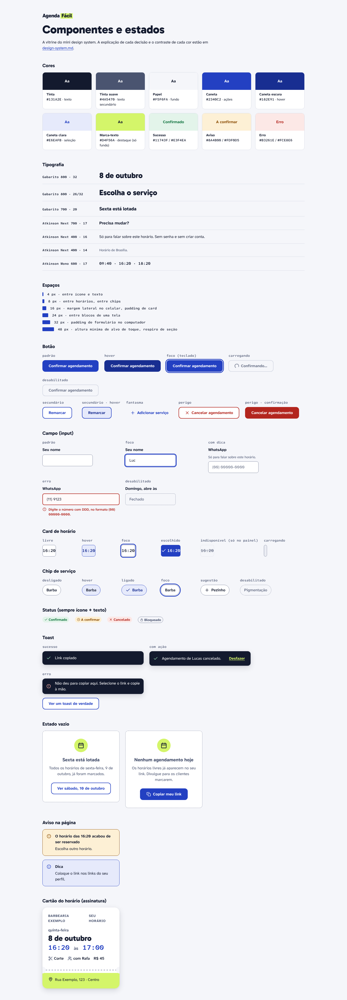

# Mini design system · Agenda Fácil

Um design system pequeno, do tamanho do projeto: cores, tipos, espaços e os componentes que as telas usam, cada um com todos os estados. Tudo vira variável CSS em [`prototipo/estilos/tokens.css`](prototipo/estilos/tokens.css), e os componentes estão em [`prototipo/estilos/componentes.css`](prototipo/estilos/componentes.css). A vitrine com todos os estados lado a lado é a página [`prototipo/componentes.html`](prototipo/componentes.html).

## A ideia por trás da identidade

O Agenda Fácil substitui o **caderno de agenda** e o **cartãozinho de papel** com o próximo horário que muito salão entrega no balcão. Daí vieram as duas cores e a peça principal:

- **Azul-caneta** para tudo que é ação: é a cor da caneta esferográfica com que o dono anota o horário.
- **Verde marca-texto** como destaque, usado pouco: no logotipo, no canhoto do cartão do horário, no "hoje" da faixa de dias e no ícone dos estados vazios.
- **Cartão do horário** na tela de confirmação: é a única peça "ousada" do produto. Tem picote e canhoto, como o cartão de papel. Todo o resto é quieto e funcional.

Escolhi de propósito fugir do terracota do meu portfólio e dos visuais que viraram padrão em sites gerados por IA (fundo creme com acento terracota; preto com verde-ácido).

---

## Cores

Os nomes das variáveis são palavras do mundo do produto (tinta, papel, caneta, marca-texto), para eu lembrar para que serve cada cor.

| Token | Hex | Uso | Regra |
|---|---|---|---|
| `--tinta` | `#131A2E` | Texto principal, fundo do toast | |
| `--tinta-suave` | `#4A5470` | Texto secundário, rótulos de apoio | |
| `--tinta-dica` | `#6B7389` | Placeholder e texto de controle desabilitado | Só sobre branco ou em controle desabilitado |
| `--papel` | `#F5F6FA` | Fundo da página | |
| `--superficie` | `#FFFFFF` | Cards, campos, janelas | |
| `--linha` | `#D6DAE5` | Divisórias | Decorativa: nunca é o único limite de um controle |
| `--linha-forte` | `#79819A` | Borda de campo, de horário, de chip | Mínimo de 3:1 para limite de controle |
| `--caneta` | `#2340C2` | Botão principal, links, seleção, foco | |
| `--caneta-escura` | `#182E91` | Hover e pressionado | |
| `--caneta-clara` | `#E6EAFB` | Fundo de hover e de item escolhido | |
| `--marca-texto` | `#D4F56A` | Destaque | **Só como fundo, atrás de `--tinta`.** Nunca como texto (1,23:1 sobre branco) |
| `--sucesso` / `--sucesso-fundo` | `#11743F` / `#E3F4EA` | "Confirmado", selo de deu certo | Sempre com ícone e texto |
| `--aviso` / `--aviso-fundo` | `#8A4B00` / `#FDF0D5` | "A confirmar", avisos de atenção | Sempre com ícone e texto |
| `--erro` / `--erro-fundo` | `#B3261E` / `#FCE8E6` | Erros de campo, ações destrutivas | Sempre com ícone e texto |

### Contraste conferido

A razão de contraste de cada combinação usada nas telas foi calculada com a fórmula da WCAG 2.2 (luminância relativa). AA pede **4,5:1** para texto normal, **3:1** para texto grande (24 px, ou 19 px em negrito) e **3:1** para bordas de controles e ícones que passam informação.

| Texto ou elemento | Fundo | Razão | Resultado |
|---|---|---|---|
| `--tinta` | `--papel` | 16,01:1 | AA e AAA |
| `--tinta` | `--superficie` | 17,29:1 | AA e AAA |
| `--tinta-suave` | `--papel` | 6,96:1 | AA |
| `--tinta-suave` | `--superficie` | 7,52:1 | AA e AAA |
| `--tinta-suave` | `--caneta-clara` | 6,27:1 | AA |
| `--tinta-dica` (placeholder) | `--superficie` | 4,73:1 | AA |
| `--tinta-dica` (controle desabilitado) | `--papel` | 4,38:1 | Isento: a WCAG não exige contraste de controle desabilitado |
| `--caneta` (link) | `--superficie` | 8,13:1 | AA e AAA |
| `--caneta` (link) | `--papel` | 7,53:1 | AA e AAA |
| Branco (botão principal) | `--caneta` | 8,13:1 | AA e AAA |
| Branco (hover) | `--caneta-escura` | 11,42:1 | AA e AAA |
| `--caneta` (item escolhido) | `--caneta-clara` | 6,78:1 | AA |
| `--caneta-escura` (chip ligado) | `--caneta-clara` | 9,53:1 | AA e AAA |
| `--tinta` | `--marca-texto` | 14,05:1 | AA e AAA |
| `--sucesso` | `--sucesso-fundo` | 5,12:1 | AA |
| Branco (selo de sucesso) | `--sucesso` | 5,84:1 | AA |
| `--aviso` | `--aviso-fundo` | 6,03:1 | AA |
| `--erro` | `--erro-fundo` | 5,55:1 | AA |
| `--erro` | `--superficie` | 6,54:1 | AA |
| Branco (botão de cancelar) | `--erro` | 6,54:1 | AA |
| `--marca-texto` (ação do toast) | `--tinta` | 14,05:1 | AA e AAA |
| `--linha-forte` (borda de controle) | `--superficie` | 3,87:1 | Passa os 3:1 de limite de controle |
| `--linha-forte` (borda de controle) | `--papel` | 3,59:1 | Passa os 3:1 de limite de controle |

Além da conta, o axe-core verificou o contraste em todas as 24 telas e estados do protótipo, sem nenhuma violação (`npm run verificar` em [`ferramentas/`](ferramentas/)).

---

## Tipografia

| Papel | Fonte | Por quê |
|---|---|---|
| Títulos (com moderação) | **Gabarito** 700 e 800 | Geométrica, firme, com personalidade nos pesos altos. Uso só em títulos, no logotipo e no dia do cartão. |
| Texto e interface | **Atkinson Hyperlegible Next** 400, 600 e 700 | Criada pelo Braille Institute para leitores com baixa visão: letras que costumam se confundir (I, l, 1; 0, O) têm desenhos bem diferentes. Num produto em que o cliente pode ser qualquer pessoa, legibilidade vem primeiro. |
| Horários | **Atkinson Hyperlegible Mono** 500 e 600 | Números com a mesma largura: os horários ficam alinhados na grade e na agenda (09:40 embaixo de 16:20). |

As três têm licença SIL Open Font License e estão dentro do projeto ([`prototipo/fontes/`](prototipo/fontes/)), então o protótipo abre igual sem internet.

### Escala

| Token | Tamanho / altura da linha | Onde |
|---|---|---|
| `--texto-destaque` | 32 / 36 px | Dia no cartão do horário |
| `--texto-h1` | 26 / 32 px no celular, 32 / 38 px no computador | Título da tela ("Quando?") |
| `--texto-h2` | 20 / 26 px | Título de seção, título de estado vazio |
| `--texto-h3` | 17 / 24 px | Turnos (Manhã, Tarde), títulos pequenos |
| `--texto-corpo` | 16 / 24 px | Texto e **todos os campos** (com menos de 16 px o iPhone dá zoom ao tocar no campo) |
| `--texto-pequeno` | 14 / 20 px | Dicas, legendas, selos. É o menor tamanho usado. |
| `--texto-hora` | 17 / 24 px, mono | Card de horário |

---

## Espaços

Múltiplos de 4, com seis valores. Ter poucos valores faz as telas ficarem consistentes sem eu precisar pensar.

| Token | Valor | Uso típico |
|---|---|---|
| `--esp-4` | 4 px | Entre ícone e texto; entre as partes da barra de passos |
| `--esp-8` | 8 px | Entre horários, entre chips, entre itens de lista |
| `--esp-16` | 16 px | Margem lateral no celular; padding de card |
| `--esp-24` | 24 px | Entre blocos de uma tela; padding de janela |
| `--esp-32` | 32 px | Padding de formulário no computador |
| `--esp-48` | 48 px | Respiro de seção; altura mínima de alvo de toque (`--alvo-minimo`) |

**Raios:** 8 px (campos, horários), 12 px (cards, botões), 20 px (cartão do horário, janelas), 999 px (chips e selos).
**Sombras:** duas, bem discretas (`--sombra-1` para cards, `--sombra-2` para janelas, toast e cartão do horário).

---

## Componentes

Cada componente tem os estados: **padrão, hover, foco (teclado), erro, desabilitado e carregando**, quando fazem sentido para ele. Foco é sempre o mesmo contorno azul de 3 px com 2 px de folga, em qualquer componente.

### Botão

| Variante | Quando usar |
|---|---|
| Principal (`.botao`) | A ação principal da tela. **Uma por tela.** |
| Secundário (`.botao--secundario`) | Ações de apoio ("Remarcar", "Bloquear horário"). |
| Fantasma (`.botao--fantasma`) | Ações de menor peso dentro de um bloco ("Adicionar serviço"). |
| Perigo (`.botao--perigo`) e confirmação (`.botao--perigo-cheio`) | Cancelar agendamento. O cheio só aparece dentro da janela de confirmação. |

| Estado | Como fica |
|---|---|
| Padrão | Fundo `--caneta`, texto branco, 48 px de altura, raio 12 |
| Hover | Fundo `--caneta-escura` |
| Foco | Contorno azul de 3 px |
| Carregando | Texto muda ("Confirmar agendamento" → "Confirmando…"), aparece um giro, o botão fica desabilitado (evita marcar duas vezes) |
| Desabilitado | Fundo `--papel`, borda `--linha`, texto `--tinta-dica`, cursor de proibido |

Texto do botão: verbo + o que acontece ("Confirmar agendamento", "Copiar link"), nunca "Enviar" ou "OK".

### Campo (input)

Rótulo sempre visível em cima, dica opcional, campo, mensagem de erro embaixo.

| Estado | Como fica |
|---|---|
| Padrão | Borda `--linha-forte` 1,5 px, 48 px de altura, texto de 16 px |
| Hover | Borda `--tinta-suave` |
| Foco | Contorno azul de 3 px + borda `--caneta` |
| Erro | Borda `--erro` de 2 px, fundo levemente avermelhado, mensagem com ícone e texto ligada por `aria-describedby`, `aria-invalid="true"` |
| Desabilitado | Fundo `--papel`, borda tracejada, cursor de proibido |

O erro aparece quando a pessoa sai do campo (não a cada tecla) e some assim que ela corrige. Se ela já está tocando no botão de enviar, o erro espera o envio, para o botão não pular de lugar no meio do toque.

### Card de horário

Um horário livre. É um link: tocar já leva para o próximo passo.

| Estado | Como fica |
|---|---|
| Livre | Fundo branco, borda `--linha-forte`, fonte mono 17 px, 48 px de altura |
| Hover | Fundo `--caneta-clara`, borda `--caneta` |
| Foco | Contorno azul de 3 px |
| Escolhido | Fundo `--caneta`, texto branco, ícone de check |
| Indisponível | Borda tracejada, texto riscado e "ocupado" para leitor de tela. **Só no painel**: para o cliente, horário ocupado não aparece. |
| Carregando | Esqueleto (retângulo cinza com brilho) |

### Chip de serviço

Pílula que liga e desliga (`aria-pressed`), ou rádio desenhado como pílula. Usado no tipo de negócio, nas sugestões de serviço e no filtro da agenda no celular.

| Estado | Como fica |
|---|---|
| Desligado | Borda `--linha-forte`, fundo branco |
| Hover | Borda `--caneta`, fundo `--caneta-clara` |
| Ligado | Fundo `--caneta-clara`, texto `--caneta-escura` e **ícone de check** (não é só a cor) |
| Foco | Contorno azul de 3 px |
| Desabilitado | Borda tracejada, texto `--tinta-dica` |

### Toast

Mensagem curta depois de uma ação, no rodapé da tela, dentro de um `role="status"` (o leitor de tela lê sozinho). Fica 5 segundos, ou 8 quando tem ação. A ação mais comum é "Desfazer", em `--marca-texto` sobre `--tinta`.

O texto repete a palavra da ação: "Cancelar agendamento" vira "Agendamento de Lucas cancelado".

### Estado vazio

Diz **por que** está vazio e oferece **a próxima ação**. Nunca é só "Nada aqui".

- Dia lotado, para o cliente: "Sexta está lotada" + "Ver sábado, 10 de outubro".
- Dia sem agendamento, para o dono: "Nenhum agendamento na terça, 20 de outubro" + "Copiar meu link".

### Outros componentes

- **Status:** selo com ícone e texto (Confirmado, A confirmar, Cancelado, Bloqueado).
- **Aviso na página:** borda e fundo da cor do estado, ícone e título. Ex.: "O horário das 16:20 acabou de ser reservado".
- **Passos:** "Passo 2 de 4 · Profissional" escrito + barra com 4 partes.
- **Janela (`<dialog>`):** prende o foco, fecha com Esc, devolve o foco a quem abriu.
- **Cartão do horário:** dia em Gabarito 32 px, hora em mono 28 px azul, serviço e profissional, picote e canhoto em marca-texto com o endereço.

---

## Próximos passos do design system

- **Modo escuro.** Os tokens já separam cor de uso (`--superficie`, `--tinta`...), então dá para criar um segundo conjunto de valores dentro de `@media (prefers-color-scheme: dark)`. Não fiz agora para garantir primeiro o AA no modo claro. Cada par da tabela acima vai precisar ser recalculado.
- **Estados de carregamento** desenhados em cada tela (hoje o esqueleto só existe na vitrine).
- Levar os tokens para o código da Parte 2 (os nomes ficam iguais).
