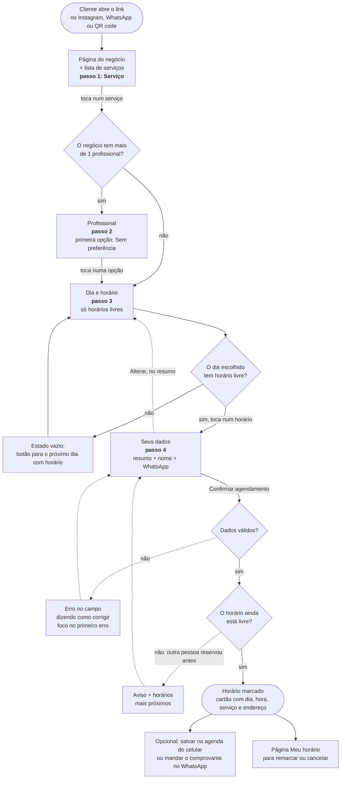
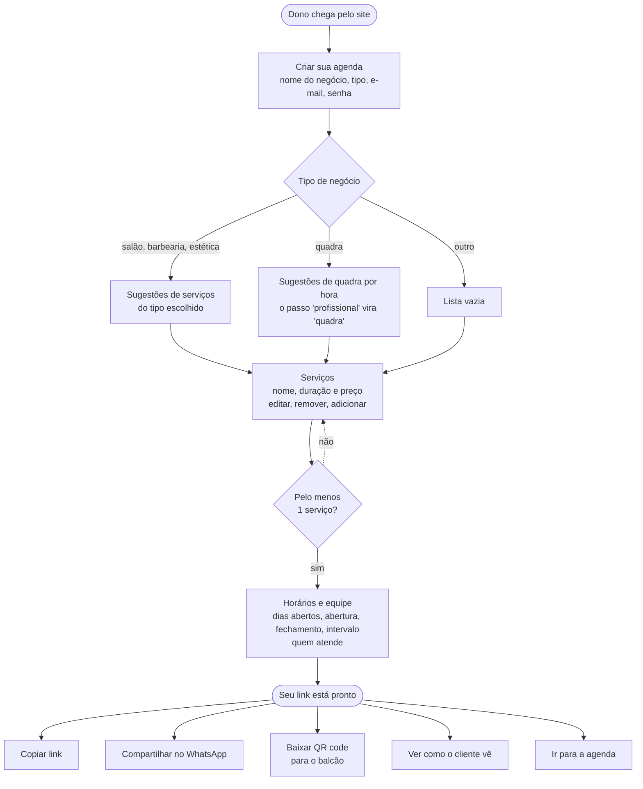
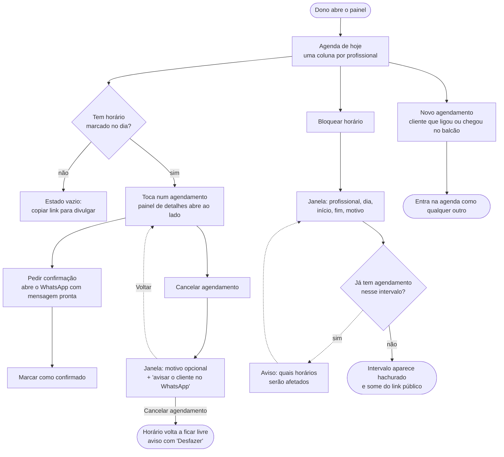

# Fluxos

Três fluxos cobrem o MVP: o cliente agenda, o dono configura, o dono gerencia o dia. Os diagramas são Mermaid: o GitHub desenha sozinho; no VS Code, use uma extensão de pré-visualização de Mermaid.

Legenda usada nos três:
- retângulo: tela ou passo
- losango: decisão (do sistema ou da pessoa)
- retângulo arredondado: início ou fim
- linha tracejada: caminho alternativo ou de erro

---

## 1. Cliente agenda um horário

Do link até a confirmação. A meta foi o **menor número de toques sem esconder informação**: escolher um serviço, um profissional ou um horário já leva para o passo seguinte (não existe botão "Continuar" nesses passos), e o único formulário é o de nome e WhatsApp.

**Quantos toques:** serviço (1) + profissional (1, ou 0 se o negócio tem uma pessoa só) + horário (1) + nome e WhatsApp + confirmar (1) = **3 a 4 toques e 2 campos**. A troca de dia não conta porque o primeiro dia com horário livre já vem selecionado.

---

## 2. Dono configura a agenda

Do cadastro até ter um link para divulgar. Cada passo já vem preenchido com uma sugestão que o dono pode aceitar como está.

---

## 3. Dono gerencia o dia

A tela "Agenda do dia" é a casa do dono. Avisar o cliente acontece pelo WhatsApp do próprio dono, com a mensagem já escrita (link `wa.me`), sem custo de API no MVP.

