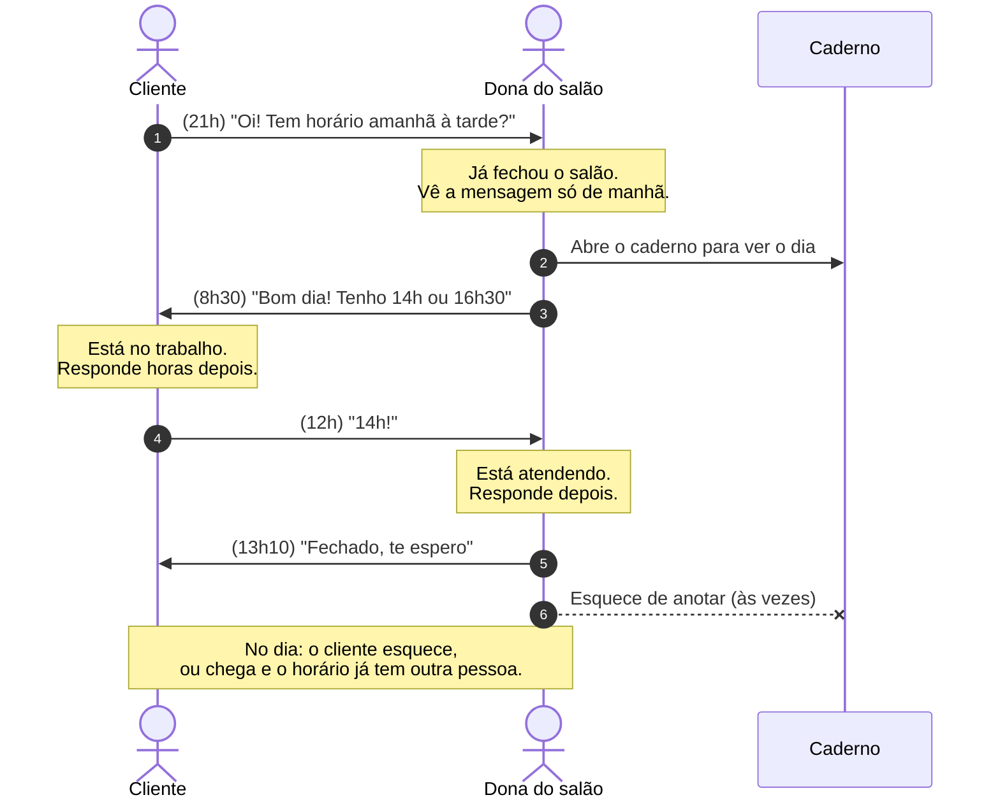

# Jornada atual: marcar horário pelo WhatsApp e anotar no caderno

> **Hipótese, validar em entrevista.** Esta é a jornada que eu *imagino* que acontece hoje, montada a partir das [proto-personas](proto-personas.md). Ainda não observei nenhum negócio de verdade.

<!-- TODO(Beatriz): depois das entrevistas, corrigir cada etapa com o que os donos e clientes contarem (perguntas D2, D3, D4, D5 e C1, C3, C7). -->

## A conversa de ida e volta

Exemplo de como imagino uma marcação hoje. As falas são ilustrativas, escritas por mim, não citações de ninguém.

## Etapas, dores e oportunidades

| Etapa | O que acontece (hipótese) | Dor (hipótese) | Oportunidade |
|---|---|---|---|
| 1. Pedir horário | O cliente manda mensagem quando lembra, muitas vezes fora do horário comercial. | O cliente não sabe quais horários estão livres; precisa perguntar. | Mostrar os horários livres a qualquer hora, sem depender de alguém responder. |
| 2. Responder | A dona responde entre um atendimento e outro, ou só no dia seguinte. | A dona para o atendimento para olhar o celular. O cliente espera e pode desistir. | O cliente marca sozinho; a dona só vê o resultado. |
| 3. Combinar | Várias mensagens até chegar num horário que serve para os dois. | Ida e volta lenta; o horário oferecido pode ser pego por outra pessoa no meio da conversa. | Escolher e reservar o horário na mesma tela, em poucos toques. |
| 4. Anotar | A dona copia o combinado no caderno. | Esquecer de anotar, anotar errado, marcar duas pessoas no mesmo horário. | A marcação já entra na agenda; não existe o passo de copiar. |
| 5. Lembrar | Cada um confia na própria memória. | Faltas sem aviso; horário vazio que poderia ter sido de outra pessoa. | Comprovante com opção de salvar na agenda do celular; lembrete numa versão futura. |
| 6. Desmarcar | O cliente manda mensagem (ou não manda) avisando. | A dona descobre a falta na hora; o horário não volta a ficar livre para outros. | Link para o próprio cliente cancelar ou remarcar, e o horário volta a ficar livre na hora. |

As oportunidades desta tabela viraram os requisitos em [requisitos.md](../requisitos.md).
